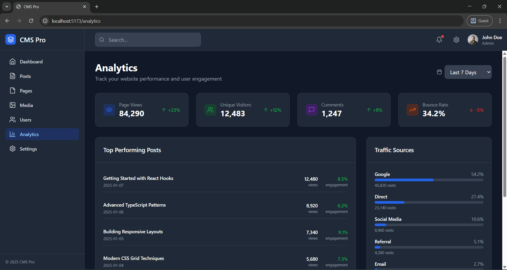
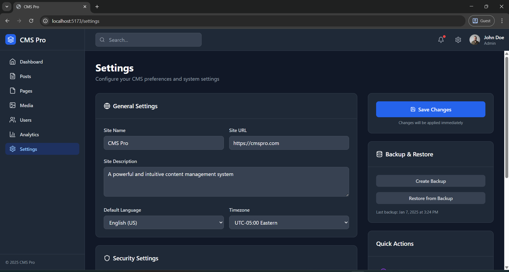

# CMS Pro

CMS Pro is an **ultra-responsive Content Management System (CMS)** built with a clean and modern UI.  
It provides administrators and content creators with powerful tools to manage posts, pages, media, users, and analytics — all in one streamlined dashboard.

---

## 🚀 Features

- **Responsive Dashboard** – Works seamlessly across all devices.
- **Content Management** – Create, edit, and organize posts and pages with ease.
- **Media Library** – Upload, store, and manage media assets.
- **User Management** – Add, edit, and control user roles.
- **Analytics** – Track page views, visitors, engagement, bounce rate, and traffic sources.
- **Settings** – Configure site preferences, security, backups, and more.
- **Quick Actions** – Speed up your workflow with shortcuts to key features.
- **Modern UI/UX** – Intuitive navigation with dark mode aesthetics.

---

## 📸 Screenshots

### Dashboard

### Analytics

### Settings

---

## 🛠️ Tech Stack

- **Frontend:** React (with Vite) / TailwindCSS  
- **Backend:** Node.js / Express (optional integration)  
- **Database:** MongoDB / SQL (customizable)  
- **Other:** Chart.js (for analytics), REST APIs  

---

## 📂 Project Structure

